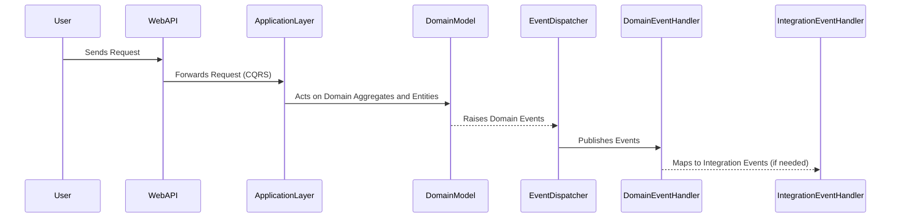

# A practical, real-world Domain-Driven Design (DDD), Clean Architecture, and CQRS Example: Basket API 🛒

> **A practical, real-world clean architecture, Domain-Driven Design (DDD) application with more than 20 design patterns for managing shopping basket operations.**

The **Basket Bounded Context** application is a real-world example of **Domain-driven Design (DDD)**, implementing patterns like **Command Query Responsibility Segregation (CQRS)** and adhering to **Clean Architecture** principles. It is responsible for managing the lifecycle of shopping baskets, including:

- Creating baskets
- Adding items
- Updating item quantities
- Removing items
- Managing Coupons
- Applying discounts and coupons

Built with **C#**, this application demonstrates how to structure software with **DDD**, **CQRS**, and **Clean Architecture**, ensuring maintainability, scalability, and adherence to domain-driven practices.

---
## 📖 Table of Contents

- [Features](#features)
- [Event Storming](#event-storming)
- [Clean Architecture Overview](#clean-architecture-overview)
- [Interaction Flow in DDD and Clean Architecture](#interaction-flow-in-ddd-and-clean-architecture)
- [Domain-Driven Design Principles and Patterns](#domain-driven-design-principles-and-patterns)
- [Design Patterns Used](#design-patterns-used)
- [Technologies Used](#technologies-used)
- [Getting Started](#getting-started)
- [Project Structure](#project-structure)
- [Usage](#usage)
- [Watch and Learn](#watch-and-learn)
- [About the Author](#about-the-author)
- [Contributing](#contributing)
- [License](#license)
---

## ✨ Features

- **Basket Management**:
  - Create baskets with basket items.
  - Underlying architecture for Add, update, and remove items.
  - Underlying architecture for Calculate total amounts including tax and shipping.

- **Coupon System**:
  - Underlying architecture for Apply and remove discount coupons.
  - Underlying architecture for Support for fixed and percentage-based discounts.

- **Clean Architecture**:
  - Separation of concerns with clearly defined layers.
  - Independent and replaceable infrastructure.

- **Domain-Driven Design**:
  - Focus on business rules encapsulated in the domain layer.
  - Events for tracking domain state changes.
  - Tactical and Strategical DDD patterns: `Ubiquitous Language`,`Bounded Context`,`Value Objects`, `Entities`, `Aggregates`, `Domain Events`, `Domain Services`, `Application services`, `Repositories`, `Factories`,`Modules`.

 - **Cross-Cutting Concerns**:
  - **Logging**: Centralized and consistent logging for debugging and monitoring.
  - **Validation**: Reusable validation logic using **FluentValidation** to ensure data integrity.
  - **Exception Handling**: Unique exception handling to provide meaningful error messages and prevent crashes.

---

## Event Storming

[View the Event Storming Board on Miro](https://miro.com/app/live-embed/uXjVL5AGgiI=/?moveToViewport=-9219,-1369,15648,7807&embedId=698754203972)

---

## 🏗 Clean Architecture Overview


**BasketContext** is structured around the **Clean Architecture** principles:

1. **Domain Layer**:
   - Contains the core business logic.
   - Aggregate Roots: `Basket`, `Coupon`.
   - Entities: `BasketItem`, `Customer`, `Seller`.
   - Value Objects: `Quantity`,`Amount`.
   - Domain Events: `BasketItemAddedEvent`, `BasketItemRemovedEvent` etc.
   - Domain Services: `ISellerLimitService`, `ICouponService`.
   - Factories : the factories for the most of domain aggregate and entities with Test factories

2. **Application Layer**:
   - Use cases for basket operations (e.g., `AddItemToBasketCommand`).
   - Interfaces for services like `ICouponService`.

3. **Infrastructure Layer**:
   - Handles persistence with **Entity Framework Core**.
   - Mapping between domain models and database entities.

4. **API Layer**:
   - Exposes HTTP endpoints for basket operations.
   - Built with **ASP.NET Core**.

## Interaction Flow in DDD and Clean Architecture

The interaction flow between components in our system is designed with DDD principles and Clean Architecture. Below is a detailed flow diagram:


---

## ⚙️ Domain-Driven Design Principles and Patterns

1. **Entities**:
   - Rich domain models encapsulating business rules.
   - Example: `Basket` ensures valid operations like adding items and calculating totals.

2. **Value Objects**:
   - Immutable objects representing concepts like `Quantity`.

3. **Aggregates**:
   - Aggregate root: `Basket` and `Coupon` Aggregate roots manage consistency across related entities.

4. **Domain Events**:
   - Notify systems of domain changes (e.g., `BasketItemDeactivatedEvent`,`BasketItemCoundUpdatedEvent`).

5. **Integration Events**:
   - Notify external systems of domain changes (e.g., `BasketItemAddedEvent`).

6. **Domain Services**:
   - Encapsulate complex business logic that doesn't naturally fit within an entity or value object.
   - Example: `ICouponService` validates and applies coupons to a basket.

7. **Modules**:
   - Group related aggregates, entities, and services into cohesive units.
   - Example: The `BasketModule` encapsulates all operations related to managing a shopping basket.

8. **Application Services**:
   - Coordinate application workflows by interacting with domain and infrastructure layers.
   - Example: `AddItemToBasketCommandHandler` orchestrates the addition of items to a basket.

9. **Factories**:
   - Provide centralized logic for creating complex domain objects while ensuring invariants are upheld.
   - Example: `BasketFactory` simplifies the creation of a `Basket` with default settings and dependencies.

10. **Repositories**:
    - Interfaces for interacting with aggregates.
    - Example: `IBasketRepository` abstracts the persistence of `Basket` entities.
11. **Ubiquitous Language**:
    - Shared terminology between developers, domain experts, and stakeholders.
    - Example: Terms like `Basket`, `BasketItem`, `Coupon`, and `Seller` are part of the shared vocabulary.

12. **Bounded Context**:
    - Defines the boundary within which the domain model is valid and consistent.
    - Example: The `BasketContext` focuses solely on shopping basket operations and is separate from contexts like `Inventory` or `Payment`.
---

## Design Patterns Used

This repository showcases the use of several well-known design patterns, providing real-world examples of how they can be applied in a **Domain-Driven Design (DDD)** and **Clean Architecture** context:

### 1. **CQRS (Command Query Responsibility Segregation)**
   - **Description**: Separates the read and write responsibilities to improve scalability and maintainability.
   - **Usage**: Command handlers are used for state-changing operations, while query handlers handle data retrieval.

### 2. **Result Pattern**
   - **Description**: Encapsulates success or failure outcomes, ensuring error handling is explicit and consistent.
   - **Usage**: Used in handler methods to return meaningful results with error messages.

### 3. **Decorator Pattern**
   - **Description**: Dynamically adds responsibilities to objects without altering their structure.
   - **Usage**: Enhances validation and business rules in the domain layer.

### 4. **Mediator Pattern**
   - **Description**: Simplifies communication between components by centralizing interactions.
   - **Usage**: Implements **MediatR** for handling commands and queries in a decoupled manner.

### 5. **Publisher-Subscriber Pattern**
   - **Description**: Enables asynchronous communication between components through event publishing and handling.
   - **Usage**: Domain events trigger integration events that are published to Kafka.

### 6. **Strategy Pattern**
   - **Description**: Enables selecting algorithms or behaviors at runtime.
   - **Usage**: Implements different discount strategies, such as percentage or fixed discounts.

### 7. **Template Method Pattern**
   - **Description**: Defines the skeleton of an algorithm, allowing subclasses to override specific steps.
   - **Usage**: `CommandHandlerBase`, `ValueObject` etc.

### 8. **Factory Method Pattern**
   - **Description**: Provides a way to instantiate objects while abstracting the creation logic.
   - **Usage**: Ensures domain objects like `Basket` and `BasketItem` are created with all invariants upheld. Test project uses multiple factories.

### 9. **Chain of Responsibility Pattern**
   - **Description**: Passes requests along a chain of handlers until one handles it.
   - **Usage**: Used for applying a series of validation or business rules sequentially.

### 10. **Unit of Work Pattern**
   - **Description**: Ensures multiple operations on a database are performed as a single transaction.
   - **Usage**: Manages database interactions in the infrastructure layer, ensuring consistency.

### 11. **And More**
   - The repository demonstrates other patterns and principles, showcasing best practices in software design and development.

---

By using these patterns, the **Basket Bounded Context** provides a real-world implementation of **clean and maintainable software architecture**, ensuring scalability and adherence to design principles.


## 💻 Technologies Used

- **C#**: The core programming language.
- **ASP.NET Core**: Web framework for building APIs.
- **Entity Framework Core**: Object-relational mapping (ORM) tool for database interactions.
- **MediatR**: Library for implementing the mediator pattern, enabling decoupled communication between application components.
- **AutoMapper**: Library for object-to-object mapping, simplifying the transformation of data transfer objects.
- **FluentValidation**: Library for building strongly-typed, reusable validation rules.
- **Ardalis.SmartEnum**: Library for managing enums with added functionality, such as encapsulating logic related to each value.
- **csharpfunctionalextensions**: Library for functional programming patterns. Only `Result` pattern used from this package.
- **Scrutor**: Library for assembly scanning and service registration in .NET Dependency Injection.
- **Confluent.Kafka**: Library for integrating with Apache Kafka, enabling message-based communication and event streaming.
- **Docker**: Containerization tool for packaging applications and dependencies.
---

## 🚀 Getting Started

### 1. Prerequisites

#### For Docker Usage
- Install [Docker Desktop](https://www.docker.com/products/docker-desktop) and ensure it is running.
- Install [Visual Studio 2022](https://visualstudio.microsoft.com/) with Docker support enabled.

#### For Non-Docker Usage
- Install .NET SDK 6.0 or later.
- Install and start SQL Server 2019 or later.
- Install and start Apache Kafka with Zookeeper.
- Optionally, install Kafka UI for managing Kafka topics.

---

### Installation

1. **Clone the Repository**:
   ```bash
   git clone https://github.com/TuralSuleymani/the-real-DDD-CQRS-CleanArchitecture.git
   ```

2. **Set Up Environment**:
   Run existing docker-compose file to start Kafka and SQL Server
   via the command:
   ```bash
   docker-compose up -d
   ```
   or run it from Visual Studio.

3. **Run the Application**:
   ```bash
   dotnet run --project src/VOEConsulting.Flame.BasketContext.Api
   ```

---

## 📂 Project Structure

```
├── src/
│   ├── VOEConsulting.Flame.BasketContext.Api/         # API Layer
│   ├── VOEConsulting.Flame.BasketContext.Application/ # Application Layer
│   ├── VOEConsulting.Flame.BasketContext.Domain/      # Domain Layer
│   ├── VOEConsulting.Flame.BasketContext.Infrastructure/ # Infrastructure Layer
    ├── VOEConsulting.Flame.Common.Core/ # For Shared elements
    ├── VOEConsulting.Flame.Common.Domain/ # Contains command domain logic elements like Entity,ValueObject,AggregateRoot,Event etc.
├── tests/
│   ├── VOEConsulting.Flame.BasketContext.Tests.Unit/  # Unit Tests
│   ├── VOEConsulting.Flame.BasketContext.Tests.Data/ # Test Data
└── README.md
```

---

## 🛠 Usage

### Example Operations

#### 1. **Create a Basket**
   Endpoint: `POST /api/baskets`
   ```json
   {
    "taxPercentage": "18",
    "customer": {
        "Id": "e15d6da4-d7e4-46ad-6e5b-f735842a2546",
        "isEliteMember": false
    }
}
   ```

#### 2. **Add an Item to the Basket**
   Endpoint: `POST /api/baskets/{basketId}/items`
   ```json
   {
  "basketId": "5739c2ae-019a-420d-9464-26753371dfe6",
  "seller": {
        "id": "123e4567-e89b-12d3-a456-426614174001",
        "name": "Seller Name",
        "rating": 4.5,
        "shippingLimit": 100.0,
        "shippingCost": 10.0
  },
  "basketItem": {
        "itemId": "323e4567-e89b-12d3-a456-426614174002",
        "name": "Hsn 5",
        "imageUrl": "https://example.com/item-image2.jpg",
        "limit": 17
  },
  "quantity": {
        "value": 2,
        "quantityLimit": 14,
        "pricePerUnit": 24.5
  }
}

   ```
---

## 🎥 Watch and Learn

To better understand Domain-Driven Design (DDD), Clean Architecture, and the concepts mentioned in this repository, check out these related videos from my YouTube channel:

1. **Video explanation of current github repo with details!**  
   
   [](https://youtu.be/TjoNaJ7n4Vg?si=bSOvy9E6wEO4-wGV)  
   *Learn more about current github repository; I'm explanation DDD(Domain-driven Design) and Clean Architecture behind this github project.*

2. **Podcast with Robert C. Martin: The Creator of Clean Architecture and SOLID Principles**  
   
   [](https://youtu.be/xNgXAQjICpQ?si=HbPefWtLg4F2vzqC)  
   *In this episode, I sit down with Robert C. Martin (Uncle Bob), the legendary author of Clean Code and Clean Architecture and creator of the SOLID principles, to explore Object-Oriented Programming, software design, and the future of development.*

3. **Podcast with Mads Torgersen: The Man Behind the C# Language**  
   
   [](https://youtu.be/2OSc8saeekM?si=Dy51ukYgJxOu016i)  
   *Explore the evolution of C#, its features, and its application in modern software development with the Lead Designer of C# language and of course, with me :).*

4. **Podcast with Rebecca Wirfs-Brock: The Creator of Responsibility-Driven Design**  
   
   [](https://youtu.be/Oi1UOnCfxJo?si=WgYza3vulLrbXJE4)  
   *In this podcast, I had the privilege to host legendary Rebecca Wirfs-Brock, where we discussed about Domain-Driven Design, Responsibility-driven design, and design heuristics.*

5. **A Deep Dive into Architecture, Functional Programming, and Dependency Injection with Mark Seemann**  
   
   [](https://youtu.be/aBtMvQdb3vs?si=tHbKd6ME72I-AVmz)  
   *In this episode, I chat with renowned software architect Mark Seemann about modern software development, covering topics like well-designed architecture, Dependency Injection, and functional programming.*

6. **An Elegant Introduction to Domain-Driven Design (DDD) and Its Patterns**  
   
   [](https://youtu.be/aBtMvQdb3vs?si=tHbKd6ME72I-AVmz)  
   *My speech at Software Architecture Conference, where I provided an overview of DDD principles, their patterns, and how they can be applied in real-world projects.*

7. **Functional programming in C# with Railway-Oriented Programming**  
   
   [](https://youtu.be/Pq4XLWxt-T8?si=pjzKQd1u9T9OJjX4)  
      *A detailed explanation of Functional Programming in C#, its use cases,values, and implementation using Railway-Oriented programming*

8. **Master the Result Pattern: The One Video You Must Watch**  
   
   [](https://youtu.be/Pq4XLWxt-T8?si=pjzKQd1u9T9OJjX4)  
   *A detailed explanation of the Result pattern, its use cases, and implementation in C# projects.*

---


## ✨ About the Author

If you found this project helpful or have any questions, feel free to connect with me:
 
- [**LinkedIn**](https://www.linkedin.com/in/tural-suleymani/)
- [**YouTube**](https://www.youtube.com/@TuralSuleymaniTech)    
- [**Dev.to**](https://dev.to/turalsuleymani)  
- [**Medium**](https://medium.com/@suleymanif.tural)
- [**Csharp**](https://www.csharp.com/members/tural-suleymani)  
- [**X (Twitter)**](https://x.com/SuleymaniTural)
 
Don't forget to ⭐ this repo if you like it!

---

## 🤝 Contributing

Contributions are welcome! Please follow these steps:

1. Fork the repository.
2. Create a new branch (`feature/your-feature`).
3. Commit your changes.
4. Push the branch.
5. Open a pull request.

---

## 📝 License

This project is licensed under the MIT License. See the [LICENSE](LICENSE) file for details.

---